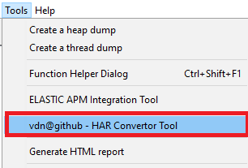
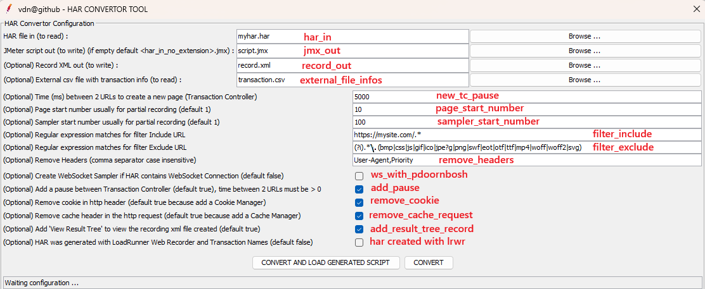
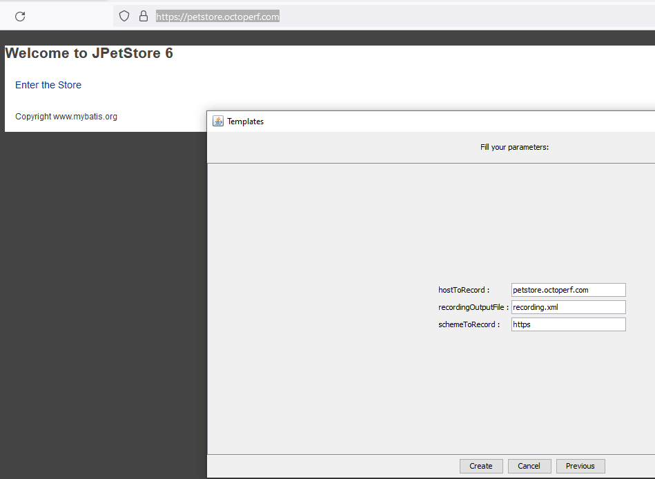
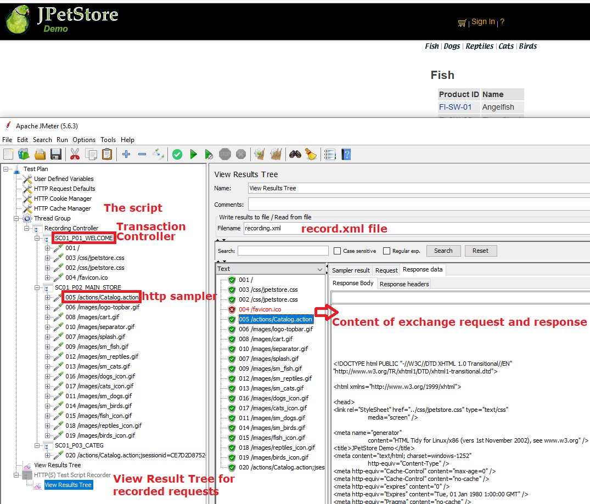
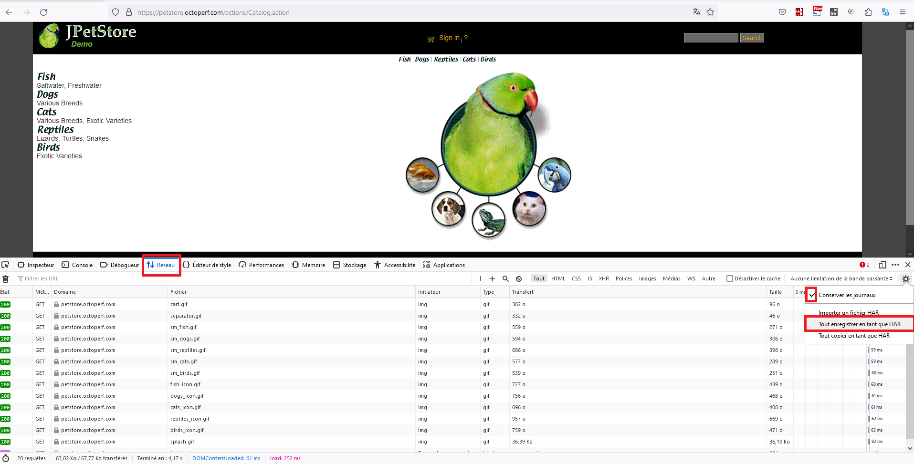
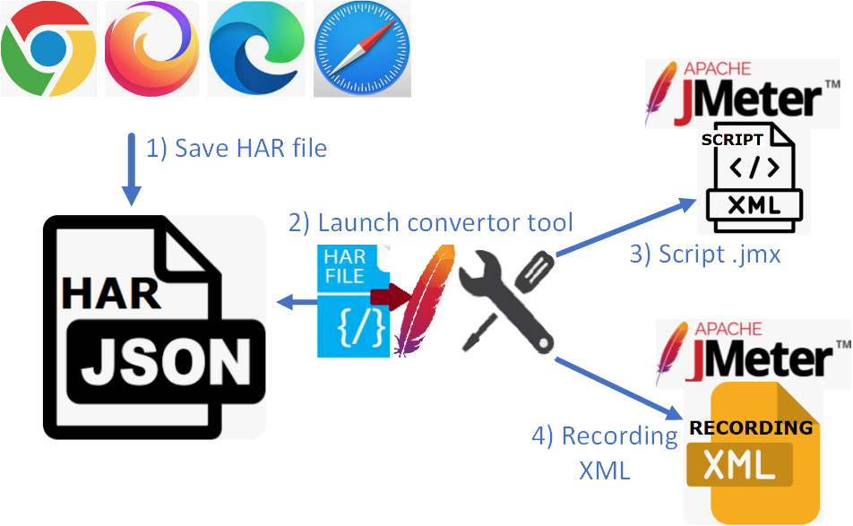
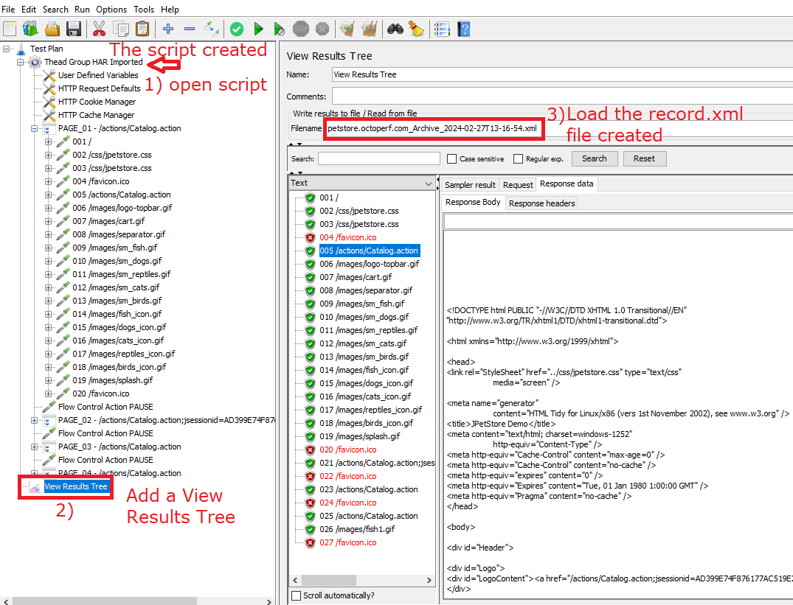

<p align="center">

  <p align="center">Convert a HAR file to a JMeter script and a Record XML file.</p>
  <p align="center"><a href="https://github.com/vdaburon/har-convertor-jmeter-plugin">Link to github project har-convertor-jmeter-plugin</a></p>
</p>

# Convert a HAR file to a JMeter script and a Record XML file.

## GUI interface in the JMeter Tools Menu
This tool is present in the Menu Tools > vdn@github - HAR Convertor Tool



When you click and the menu line "vdn@github - HAR Convertor Tool", the tool GUI is display



### Parameters
Parameters are :
* har_in the HAR file to read (exported HAR from Web Browser :  Chrome, Firefox, Edge ...)
* jmx_out the file JMeter script generated, if the text field is empty then the jmx_out is the file name of har_in without the extension with suffix ".jmx" <br/>
  e.g. har_in = myhar1.har, jmx_out is empty then file_out will be myhar1.jmx
* record_out create the record xml file from the har file (could be open with the Listener View Results Tree) <br/>
  e.g. record_out = record.xml
* new_tc_pause time between 2 urls to create a new page (Transaction Controller) (default 5000 = jmeter property value : proxy.pause=5000) <br/>
  * e.g. 5000 for 5 sec between 2 urls
* page_start_number, set the start page number for partial recording (default 1, must be an integer > 0) <br/>
* sampler_start_number, set the start sampler number for partial recording (default 1, must be an integer > 0) <br/>
* filter_include,  the regular expression matches the URL to Include <br/>
  * default all = empty (no filter)
  * e.g. filter_include=https://mysite.com/.*
* filter_exclude,  the regular expression matches the URL to Exclude <br/>
  * default all = empty (no filter)
  * e.g. filter_exclude=https://notmysite.com/.*
  * or filter statics, filter_exclude=(?i).*\.(bmp|css|js|gif|ico|jpe?g|png|swf|eot|otf|ttf|mp4|woff|woff2)
* add_pause checkbox, add Flow Control Action Pause, parameter new_tc_pause must be > 0 (default true) <br/>
* remove_cookie checkbox , remove header with cookie because add a Cookie Manager in the script (default true) <br/>
* remove_cache_request checkbox, remove cache request header because add a Cache Manager in the script (default true) <br/>


Status, the status line contains the tool status or the tool result.

e.g. : Status Results **OK**
* Tool HAR Convertor Finished OK, fileJmxOut=C:\Temp\script1.jmx
* Tool HAR Convertor Finished OK, fileJmxOut=C:\Temp\script1.jmx AND recordXmlOut=C:\Temp\record.xml

e.g. : Status Results **KO**
* Tool HAR Convertor Finished KO, CAN'T READ HAR fileHarIn = C:\Temp\harzzzz.har
* Tool HAR Convertor Finished KO, exception = java.util.regex.PatternSyntaxException: Unmatched closing ')' near index 2  (.))
* Tool HAR Convertor Finished KO, exception = net.sf.saxon.trans.XPathException: Failed to create output file file:/c:/toto.jmx

### Action buttons
* "CONVERT AND LOAD GENERATED SCRIPT", generates the JMeter script and record.xml file if set, next if no error LOAD the generated script in the current JMeter.
* "CONVERT", generates the JMeter script and record.xml file if set.

## Creating a har file and run the tool har-to-jmx-convertor to simulate recording from the JMeter recording template
This tool har-to-jmx-convertor try to **simulate** a script JMeter and a record xml file recording from the **JMeter Recording Template**.

### JMeter Recording Template and HTTP(S) Test Script Recorder  - The standard way to record
The JMeter Recording Template : <br/>


The result of recording with JMeter "HTTP(S) Test Script Recorder" : <br/>


### HAR created on a Browser (e.g. Firefox) - The new way with the convertor tool
Record the navigation in the web application with Developer tool : **Network** and **save** exchanges in **HAR** file format : <br/>


Launch the "Convertor tool" : <br/>


Tool results : Open the script created and the record.xml in a View Results Tree <br/>


## More documentation from har-to-jmeter-convertor
For more documentation look at README from [har-to-jmeter-convertor](https://github.com/vdaburon/har-to-jmeter-convertor)

## Command line tool (CLI)
This tool could be use with script shell Windows or Linux.

Scripts shell are in &lt;JMETER_HOME&gt;\bin
* har-convertor-to-jmeter.cmd for Windows OS
* har-convertor-to-jmeter.sh for Linux/Mac OS

Help to see all parameters :

<pre>
C:\apache-jmeter\bin&gt;har-convertor-to-jmeter.cmd -help
usage: io.github.vdaburon.jmeter.har.HarForJMeter [-add_pause &lt;add_pause&gt;] [-filter_exclude &lt;filter_exclude&gt;]
       [-filter_include &lt;filter_include&gt;] -har_in &lt;har_in&gt; [-help] -jmx_out &lt;jmx_out&gt; [-new_tc_pause &lt;new_tc_pause&gt;]
       [-page_start_number &lt;page_start_number&gt;] [-record_out &lt;record_out&gt;] [-remove_cache_request
       &lt;remove_cache_request&gt;] [-remove_cookie &lt;remove_cookie&gt;] [-sampler_start_number &lt;sampler_start_number&gt;]
io.github.vdaburon.jmeter.har.HarForJMeter
 -add_pause &lt;add_pause&gt;                         Optional boolean, add Flow Control Action Pause after Transaction
                                                Controller (default true)
 -filter_exclude &lt;filter_exclude&gt;               Optional, regular expression to exclude url
 -filter_include &lt;filter_include&gt;               Optional, regular expression to include url
 -har_in &lt;har_in&gt;                               Har file to read (e.g : my_file.har)
 -help                                          Help and show parameters
 -jmx_out &lt;jmx_out&gt;                             JMeter file created to write (e.g : script.jmx)
 -new_tc_pause &lt;new_tc_pause&gt;                   Optional, create new Transaction Controller after request ms, same as
                                                jmeter property : proxy.pause, need to be &gt; 0 if set. Usefully for Har
                                                created by Firefox or Single Page Application (Angular, ReactJS, VuesJS
                                                ...)
 -page_start_number &lt;page_start_number&gt;         Optional, the start page number for partial recording (default 1)
 -record_out &lt;record_out&gt;                       Optional, file xml contains exchanges likes recorded by JMeter
 -remove_cache_request &lt;remove_cache_request&gt;   Optional boolean, remove cache header in the http request (default true
                                                because add a Cache Manager)
 -remove_cookie &lt;remove_cookie&gt;                 Optional boolean, remove cookie in http header (default true because add
                                                a Cookie Manager)
 -sampler_start_number &lt;sampler_start_number&gt;   Optional, the start sampler number for partial recording (default 1)
E.g : java -jar har-for-jmeter-&lt;version&gt;-jar-with-dependencies.jar -har_in myhar.har -jmx_out scriptout.jmx
-new_tc_pause 5000 -add_pause true -filter_include "https://mysite/.*" -filter_exclude "https://notmysite/*"
-page_start_number 50 -sampler_start_number 250
</pre>


<pre>
C:\apache-jmeter\bin>har-convertor-to-jmeter.cmd -har_in "myhar.har" -jmx_out "script_out.jmx" -filter_include "https://mysite.com/.*" -filter_exclude "https://notmysite.com/.*" -add_pause true -new_tc_pause 5000
</pre>

<pre>
/var/opt/apache-jmeter/bin>./har-convertor-to-jmeter.sh -har_in "myhar.har" -jmx_out "script_out.jmx" -record_out "record.xml" -add_pause true -new_tc_pause 5000
</pre>

## Tool installed with jmeter-plugins-manager
This tool could be installed with the jmeter-plugins-manager from jmeter.plugins.org.<br>
The tool name is : "vdn@github - har-convertor-jmeter-tool"

## Usage Maven
The maven groupId, artifactId and version, this plugin is in the **Maven Central Repository** [](https://maven-badges.herokuapp.com/maven-central/io.github.vdaburon/har-convertor-jmeter-plugin)

```xml
<groupId>io.github.vdaburon</groupId>
<artifactId>har-convertor-jmeter-plugin</artifactId>
<version>3.2</version>
```
## Versions
Version 3.2 date 2024-03-30, Use library har-to-jmeter-convertor-2.2.jar, this version encode value for x-www-form-urlencoded when value contains space ' ' or equal '=' or slash '/' or plus '+' characters. Correct add the content for body data for POST, PUT or PATCH if not x-www-form-urlencoded in the Record.xml file.

Version 3.1 date 2024-03-29, Use library har-to-jmeter-convertor-2.2.jar, this version remove the header 'Content-length' because the length is computed by JMeter when the request is created. POST or PUT could have query string and body with content so add query string to the path. Set Content Encoding to UFT-8 for POST or PUT method and request Content-Type : application/json. Add body data content in record.xml for PUT and PATCH methods.

Version 3.0 date 2024-03-18, Add Load generated script if no error. File Chooser select only file and no directory.

Version 2.0 date 2024-03-12, for POST multipart/form-data don't put the content of the file in the Record.xml file because binary content could be large and not XML compatible. Add parameters : page_start_number and sampler_start_number to facilitate partial recording of website navigation.

Version 1.0 date 2024-03-11, First Release.

