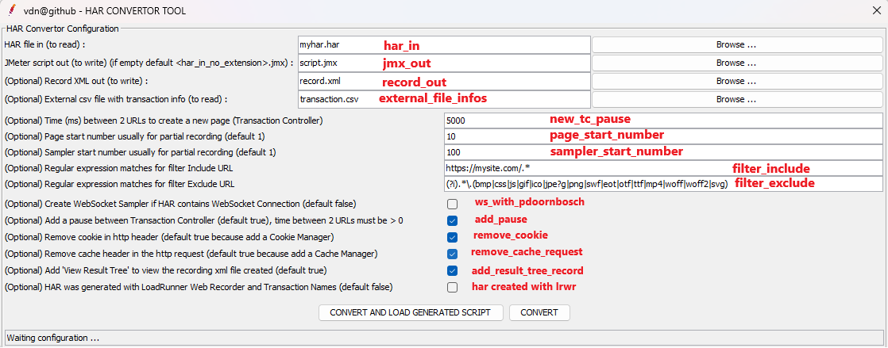
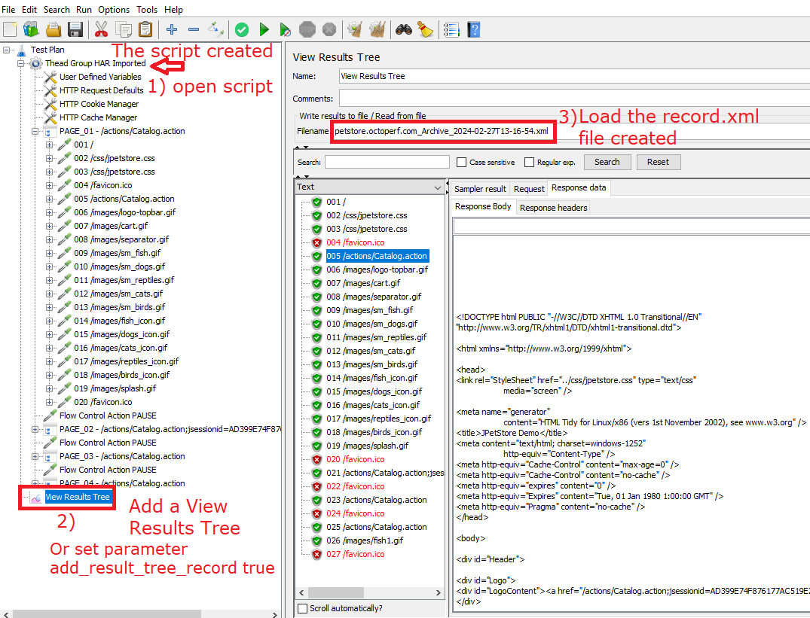

<p align="center">

  <p align="center">Convert a HAR file to a JMeter script and a Record XML file.</p>
  <p align="center"><a href="https://github.com/vdaburon/har-convertor-jmeter-plugin">Link to github project har-convertor-jmeter-plugin</a></p>
</p>

# Convert a HAR (Http ARchive) file to a JMeter script and a Record XML file.
[](https://central.sonatype.com/artifact/io.github.vdaburon/har-convertor-jmeter-plugin)
[](https://github.com/vdaburon/CreateHtmlForFilesInDirectory/blob/main/LICENSE)

[](https://jmeter.apache.org/)

An article about motivations to create this tool: https://dzone.com/articles/convert-a-har-file-to-jmeter-script

Since version 7.0, **Websocket** is manage with samplers from the plugin "WebSocket Samplers by Peter Doornbosch".

## GUI interface in the JMeter Tools Menu
This tool is present in the Menu Tools > vdn@github - HAR Convertor Tool


When you click and the menu line "vdn@github - HAR Convertor Tool", the tool GUI is display



### Parameters
Parameters are :
* har_in the HAR file to read (exported HAR from Web Browser :  Chrome, Firefox, Edge ...)
* jmx_out the file JMeter script generated, if the text field is empty then the jmx_out is the file name of har_in without the extension with suffix ".jmx" <br/>
  e.g. har_in = myhar1.har, jmx_out is empty then file_out will be myhar1.jmx
* record_out create the record xml file from the har file (could be open with the Listener View Results Tree) <br/>
  e.g. record_out = record.xml
* add_result_tree_record, add a View Result Tree to view the Recording XML File Generated (default true), the record_out must be not empty
* ws_with_pdoornbosch, create WebSocket Sampler if HAR contains WebSocket Connection (ws or wss) and WebSocket Exchange message (default false). Need this JMeter plugin "WebSocket Samplers by Peter Doornbosch" to open generated JMeter script.
* external_file_infos, external csv file contains information about Timestamp, Transaction Name, date start or end. <br/>
    e.g. external_file_infos = myappli_transactions.csv
* new_tc_pause time between 2 urls to create a new page (Transaction Controller) (default 5000 = jmeter property value : proxy.pause=5000) <br/>
  * e.g. 5000 for 5 sec between 2 urls
* page_start_number, set the start page number for partial recording (default 1, must be an integer > 0) <br/>
* sampler_start_number, set the start sampler number for partial recording (default 1, must be an integer > 0) <br/>
* filter_include, the regular expression matches the URL to Include (first filter) <br/>
  * default all = empty (no filter)
  * e.g. filter_include=https://mysite.com/.*
* filter_exclude, the regular expression matches the URL to Exclude (second filter) <br/>
  * default all = empty (no filter)
  * e.g. filter_exclude=https://notmysite.com/.*
  * or filter statics, filter_exclude=(?i).*\.(bmp|css|js|gif|ico|jpe?g|png|swf|eot|otf|ttf|mp4|woff|woff2|svg)
* remove_headers, remove a list of http headers (comma separator, case insensitive), e.g: <code>-remove_headers "User-Agent,Pragma,X-TOKEN"</code> 
* add_pause checkbox, add Flow Control Action Pause, parameter new_tc_pause must be > 0 (default true) <br/>
* remove_cookie checkbox , remove header with cookie because add a Cookie Manager in the script (default true) <br/>
* remove_cache_request checkbox, remove cache request header because add a Cache Manager in the script (default true) <br/>
* har created with lrwr, the har file has been generated with LoadRunner Web Recorder Chrome extension and contains Transaction Name, expected values : true or false (default false = unchecked) <br/>


Status, the status line contains the tool status or the tool result.

e.g. : Status Results **OK**
* Tool HAR Convertor Finished OK, fileJmxOut=C:\Temp\script1.jmx
* Tool HAR Convertor Finished OK, fileJmxOut=C:\Temp\script1.jmx AND recordXmlOut=C:\Temp\record.xml

e.g. : Status Results **KO**
* Tool HAR Convertor Finished KO, CAN'T READ HAR fileHarIn = C:\Temp\harzzzz.har
* Tool HAR Convertor Finished KO, exception = java.util.regex.PatternSyntaxException: Unmatched closing ')' near index 2  (.))
* Tool HAR Convertor Finished KO, exception = net.sf.saxon.trans.XPathException: Failed to create output file file:/c:/toto.jmx

### Action buttons
* "CONVERT AND LOAD GENERATED SCRIPT", generates the JMeter script and record.xml file if set, next if no error LOAD the generated script in the current JMeter.
* "CONVERT", generates the JMeter script and record.xml file if set.

## Creating a har file and run the tool har-to-jmx-convertor to simulate recording from the JMeter recording template
This tool har-to-jmx-convertor try to **simulate** a script JMeter and a record xml file recording from the **JMeter Recording Template**.

### JMeter Recording Template and HTTP(S) Test Script Recorder  - The standard way to record
The JMeter Recording Template : <br/>


The result of recording with JMeter "HTTP(S) Test Script Recorder" : <br/>


### HAR created on a Browser (e.g. Firefox) - The new way with the convertor tool
Record the navigation in the web application with Developer tool : **Network** and **save** exchanges in **HAR** file format : <br/>


Launch the "Convertor tool" : <br/>


Tool results : Open the script created and the record.xml in a View Results Tree <br/>


### Standard HAR file created with Firefox, Chrome, Edge with external csv file for transaction information
You could add an external file that contains information about transaction name start and end.


The format is :
- <code>Timestamp iso format GMT;TRANSACTION;transaction name;start</code> for starting a new transaction
- <code>Timestamp iso format GMT;TRANSACTION;transaction name;stop</code> for ending transaction the precedent transaction
- Separator ";"
- Charset UTF-8

E.g :
<pre>
2024-05-06T12:39:58.711Z;TRANSACTION;login;start
2024-05-06T12:40:08.643Z;TRANSACTION;login;stop
2024-05-06T12:40:20.880Z;TRANSACTION;home;start
2024-05-06T12:40:37.634Z;TRANSACTION;home;stop
</pre>

A simple tool named "create-external-file-for-har" create easily this csv file. https://github.com/vdaburon/create-external-file-for-har

You need to select the csv file in the text field : "(Optional) External csv file with transaction info (to read) "

### HAR created with BrowserUp Proxy
This tool is compatible with Har file generated with BrowserUp Proxy.

The BrowserUp Proxy create a har and could filter url or content (no binary).

The proxy client could be a browser or a client http in an application.

BrowserUp Proxy could be embedded in a java application or in Selenium java code application.


The BrowserUp Proxy **active** project is available at this url : <br/>
[Goto the BrowserUp Proxy active project](https://github.com/valfirst/browserup-proxy)

Note : The BrowserMod Proxy tool is no more active (since september 2017) and it's recommended to migrate to BrowerUp proxy https://github.com/valfirst/browserup-proxy the "valfirst" GitHub username is important.

### HAR created in Chrome Browser with the OpenText Professional Performance Engineering (LoadRunner) Web Recorder Chrome Extension
This tool is compatible with Har file generated with the LoadRunner Web Recorder Chrome Extension.

The main advantage is to declare **Transaction Names when recording** and navigate to the web site. This transactions will be Page Names (Transaction Controllers names) in the JMeter script.


The OpenText Professional Performance Engineering (LoadRunner) Web Recorder Chrome Extension is available at this url : <br/>
[Download the Recorder extension for Chrome : "HarGeneratorChrome"](https://marketplace.opentext.com/appdelivery/content/recorder-extension-for-chrome)

You need to check to checkbox "HAR was generated with LoadRunner Web Recorder and Transaction Names" to indicate that is a HAR file generated with LoadRunner Web Recorder (lrwr), default false (unchecked).

## Websocket use the plugin "WebSocket Samplers by Peter Doornbosch"
If your Har file contains WebSocket Connection and Messages, check the checkbox <code>ws_with_pdoornbosch</code> (set true), this tool will try to create Websocket Samplers in the JMeter script generated and the exchanges in the Recording XML file if you set the record xml file name.

Documentation at : https://bitbucket.org/pjtr/jmeter-websocket-samplers/src/master/

The HAR is record from **Chrome** Browser not Firefox Browser and not Egde Browser (research in har file the attribute : '_webSocketMessages').

Currently limitation to only one websocket connection and multi text messages (send or receive) in this websocket connection (binary message is not tested).

Text message could be on "STOMP" format (https://en.wikipedia.org/wiki/Streaming_Text_Oriented_Messaging_Protocol) or no "STOMP" (simple text).

Need the plugin "WebSocket Samplers by Peter Doornbosch" to open the generated script that contain Websocket Samplers.

This demonstration use the web site : https://websocket.org/tools/websocket-echo-server/


If you click on the checkbox "Create WebSocket Sampler if HAR contains WebSocket Connection" but the JMeter **have not the plugin** "WebSocket Samplers by Peter Doornbosch" a warning message is display and the button "CONVERT AND LOAD GENERATED SCRIPT" is disable.


## More documentation from har-to-jmeter-convertor CLI Tool
This plugin use a **library** from the Command Line Interface tool (har-to-jmeter-convertor)<br/>
For more documentation look at README from [har-to-jmeter-convertor](https://github.com/vdaburon/har-to-jmeter-convertor)

## Command line tool (CLI)
This tool could be use with script shell Windows or Linux.

Scripts shell are in &lt;JMETER_HOME&gt;\bin
* har-convertor-to-jmeter.cmd for Windows OS
* har-convertor-to-jmeter.sh for Linux/Mac OS

Help to see all parameters :

<pre>
C:\apache-jmeter\bin&gt;har-convertor-to-jmeter.cmd -help

usage: io.github.vdaburon.jmeter.har.HarForJMeter [-add_pause &lt;add_pause&gt;] [-add_result_tree_record
       &lt;add_result_tree_record&gt;] [-external_file_infos &lt;external_file_infos&gt;] [-filter_exclude &lt;filter_exclude&gt;]
       [-filter_include &lt;filter_include&gt;] -har_in &lt;har_in&gt; [-help] -jmx_out &lt;jmx_out&gt; [-new_tc_pause &lt;new_tc_pause&gt;]
       [-page_start_number &lt;page_start_number&gt;] [-record_out &lt;record_out&gt;] [-remove_cache_request
       &lt;remove_cache_request&gt;] [-remove_cookie &lt;remove_cookie&gt;] [-remove_headers &lt;remove_headers&gt;]
       [-sampler_start_number &lt;sampler_start_number&gt;] [-use_lrwr_infos &lt;use_lrwr_infos&gt;] [-ws_with_pdoornbosch
       &lt;ws_with_pdoornbosch&gt;]
io.github.vdaburon.jmeter.har.HarForJMeter
 -add_pause &lt;add_pause&gt;                             Optional boolean, add Flow Control Action Pause after Transaction
                                                    Controller (default true)
 -add_result_tree_record &lt;add_result_tree_record&gt;   Optional boolean, add 'View Result Tree' to view the record.xml file
                                                    created (default true), record_out must be not empty
 -external_file_infos &lt;external_file_infos&gt;         Optional, csv file contains external infos : timestamp transaction
                                                    name and start or end
 -filter_exclude &lt;filter_exclude&gt;                   Optional, regular expression to exclude url
 -filter_include &lt;filter_include&gt;                   Optional, regular expression to include url
 -har_in &lt;har_in&gt;                                   Har file to read (e.g : my_file.har)
 -help                                              Help and show parameters
 -jmx_out &lt;jmx_out&gt;                                 JMeter file created to write (e.g : script.jmx)
 -new_tc_pause &lt;new_tc_pause&gt;                       Optional, create new Transaction Controller after request ms, same
                                                    as jmeter property : proxy.pause, need to be &gt; 0 if set. Usefully
                                                    for Har created by Firefox or Single Page Application (Angular,
                                                    ReactJS, VuesJS ...)
 -page_start_number &lt;page_start_number&gt;             Optional, the start page number for partial recording (default 1)
 -record_out &lt;record_out&gt;                           Optional, file xml contains exchanges likes recorded by JMeter
 -remove_cache_request &lt;remove_cache_request&gt;       Optional boolean, remove cache header in the http request (default
                                                    true because add a Cache Manager)
 -remove_cookie &lt;remove_cookie&gt;                     Optional boolean, remove cookie in http header (default true because
                                                    add a Cookie Manager)
 -remove_headers &lt;remove_headers&gt;                   Remove a list of headers (comma separator, case insensitive),
                                                    e.g:User-Agent,Pragma,X-TOKEN
 -sampler_start_number &lt;sampler_start_number&gt;       Optional, the start sampler number for partial recording (default 1)
 -use_lrwr_infos &lt;use_lrwr_infos&gt;                   Optional, the har file has been generated with LoadRunner Web
                                                    Recorder and contains Transaction Name, expected value :
                                                    'transaction_name' or don't add this parameter
 -ws_with_pdoornbosch &lt;ws_with_pdoornbosch&gt;         Optional boolean, Manage websocket messages with the JMeter plugin
                                                    from Peter DOORNBOSH (default false), if true need the plugin from
                                                    Peter DOORNBOSH to open the generated script
E.g : java -jar har-for-jmeter-&lt;version&gt;-jar-with-dependencies.jar -har_in myhar.har -jmx_out scriptout.jmx -record_out
recording.xml -add_result_tree_record true -new_tc_pause 5000 -add_pause true -filter_include "https://mysite/.*"
-filter_exclude "https://notmysite/*" -page_start_number 50 -sampler_start_number 250 -ws_with_pdoornbosch false
-remove_headers "User-Agent,Pragma"

</pre>

<pre>
C:\apache-jmeter\bin>har-convertor-to-jmeter.cmd -har_in "myhar.har" -jmx_out "script_out.jmx" -filter_include "https://mysite.com/.*" -filter_exclude "https://notmysite.com/.*" -add_pause true -new_tc_pause 5000
</pre>

<pre>
/var/opt/apache-jmeter/bin>./har-convertor-to-jmeter.sh -har_in "myhar.har" -jmx_out "script_out.jmx" -record_out "record.xml" -add_pause true -new_tc_pause 5000
</pre>

## Tool installed with jmeter-plugins-manager
This tool could be installed with the jmeter-plugins-manager from jmeter.plugins.org.<br>
The tool name is : "vdn@github - har-convertor-jmeter-tool"

## Usage Maven
The maven groupId, artifactId and version, this plugin is in the **Maven Central Repository** [](https://maven-badges.herokuapp.com/maven-central/io.github.vdaburon/har-convertor-jmeter-plugin)

```xml
<groupId>io.github.vdaburon</groupId>
<artifactId>har-convertor-jmeter-plugin</artifactId>
<version>8.0</version>
```

## License
Licensed under the Apache License, Version 2.0

## Versions
Version 8.0 date 2025-11-22, Use new library har-to-jmeter-convertor 8.0 add new parameter <code>-remove_headers</code> remove a list of http headers (comma separator, case insensitive), e.g: <code>-remove_headers "User-Agent,Pragma,X-TOKEN"</code>

Version 7.1 date 2025-03-27, Use new library har-to-jmeter-convertor 7.1 remove request headers from HTTP/2, these headers start with ':' likes ":authority", ":method", ":path" or ":scheme" correct Issue #2. Don't create HttpSampler for url "data:".

Version 7.0 date 2025-02-27, Use new library har-to-jmeter-convertor 7.0 add manage the websocket messages with 'WebSocket Samplers by Peter Doornbosch', add checkbox for boolean parameter 'ws_with_pdoornbosch' (default unchecked == false).

Version 6.1 date 2025-01-28, Use new library har-to-jmeter-convertor 6.1 to correct a NullPointerException when creating the Recording XML file.

Version 6.0 date 2024-09-19, Use new library har-to-jmeter-convertor 6.0 for adding 'HTTP(S) Test Script Recorder' and 'View Results Tree' to view the Record.xml file created. Correct save file no url encoded name.

Version 5.3 date 2024-09-13, Use new library har-to-jmeter-convertor 5.3 that correct PUT with no parameter, no content and mime-type ==  null

Version 5.2 date 2024-06-20, Use new library har-to-jmeter-convertor 5.2 that correct extract parameters for mime type "form-urlencoded" ended with charset likes "application/x-www-form-urlencoded; charset=xxx"

Version 5.1 date 2024-05-17, Compatible with har generated by browsermob-proxy tool and csv file contains transaction infos. Use library har-to-jmeter-convertor 5.1.

Version 5.0 date 2024-05-10, Add an external csv file with transaction information for JMeter Transaction Controller Name. New parameter : <code>-external_file_infos transaction_info.csv</code>. Correct Filter Include first filter and Filter Exclude second filter.

Version 4.0 date 2024-05-06, Add compatibility with HAR generated with LoadRunner Web Recorder Chrome Extension. New checkbox "(Optional) HAR was generated with LoadRunner Web Recorder and Transaction Names"

Version 3.2 date 2024-03-30, Use library har-to-jmeter-convertor-2.2.jar, this version encode value for x-www-form-urlencoded when value contains space ' ' or equal '=' or slash '/' or plus '+' characters. Correct add the content for body data for POST, PUT or PATCH if not x-www-form-urlencoded in the Record.xml file.

Version 3.1 date 2024-03-29, Use library har-to-jmeter-convertor-2.2.jar, this version remove the header 'Content-length' because the length is computed by JMeter when the request is created. POST or PUT could have query string and body with content so add query string to the path. Set Content Encoding to UFT-8 for POST or PUT method and request Content-Type : application/json. Add body data content in record.xml for PUT and PATCH methods.

Version 3.0 date 2024-03-18, Add Load generated script if no error. File Chooser select only file and no directory.

Version 2.0 date 2024-03-12, for POST multipart/form-data don't put the content of the file in the Record.xml file because binary content could be large and not XML compatible. Add parameters : page_start_number and sampler_start_number to facilitate partial recording of website navigation.

Version 1.0 date 2024-03-11, First Release.

